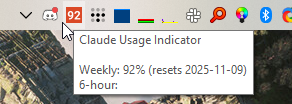

# usage-indicator

A lightweight system tray application that monitors usage statistics for rate-limited cloud services. Currently supports Claude Pro subscription tracking with intelligent adaptive polling.

See [ROADMAP.md](ROADMAP.md) for detailed future plans.

## Features

- **Adaptive Polling** - Smooth, adaptive polling based on usage change patterns
- **Rich Tooltips** - Shows usage percentages, reset times, polling state, and next check time
- **Quality Tray Icons** - On-demand generation of crisp, well-centered, super-sampled tray icons
- **Dynamic Background** - Quick reference of usage via color-coded background

## Installation

### Building from Source

Currently, the only way to run usage-indicator is to build from source.

**Prerequisites:**

- Rust (stable, 1.90.0+)
- Bun (1.3+)
- Platform-specific build tools (see [Tauri prerequisites](https://v2.tauri.app/start/prerequisites/))

**Build steps:**

```bash
# Clone the repository
git clone https://github.com/Xevion/usage-indicator.git
cd usage-indicator

# Install frontend dependencies
bun install

# Build and run in development mode
cargo tauri dev
# Build release version
cargo tauri build --release
```

## Setup

Create a `.env` file in the repository root with your Claude credentials:

```bash
# Required
CLAUDE_ORG_ID=your_org_id_here
CLAUDE_SESSION_KEY=your_session_key_here

# Optional - polling configuration (defaults shown)
POLL_MIN_INTERVAL_SECS=180        # 3 minutes
POLL_MAX_INTERVAL_SECS=5400       # 90 minutes
```

## Usage

Once running, usage-indicator lives in your system tray. The icon shows your current usage percentage in text with a color-coded background.



Hover over the icon to see detailed information:

- Weekly and 6-hour usage percentages
- Reset dates for each metric
- Current polling state and next check time

The app automatically adjusts polling frequency based on usage patterns&mdash;polling more often when you're actively using Claude, and backing off during idle periods.

## What's Next

See [ROADMAP.md](ROADMAP.md) for the complete vision, but highlights include:

- **v0.2** - CI/CD, installers, auto-launch on startup
- **v0.3** - Auto-extract credentials from browser, secure config storage
- **v0.4** - System event integration (sleep/wake awareness)
- **v0.5** - Error handling, notifications, diagnostics menu
- **v1.0** - Public release with polish and comprehensive documentation

## Security & Privacy

**Current limitations (v0.1):**

- Credentials stored in plaintext `.env` file (not suitable for shared systems)
- No encryption at rest

**Future (v0.3):**

- Credentials stored in OS keychain/credential manager
- Automatic credential extraction from browser

**Always:**

- No telemetry or analytics—all data stays local
- Credentials only transmitted to official Claude API endpoints

## License

MIT License - see [LICENSE](LICENSE) for details.

## Acknowledgments

- Built with [Tauri](https://tauri.app/)
- Adaptive polling inspired by TCP congestion control (AIMD)
- Icon rendering using [imageproc](https://github.com/image-rs/imageproc)
- Browser-like TLS request handling using [wreq](https://github.com/brson/wreq)
